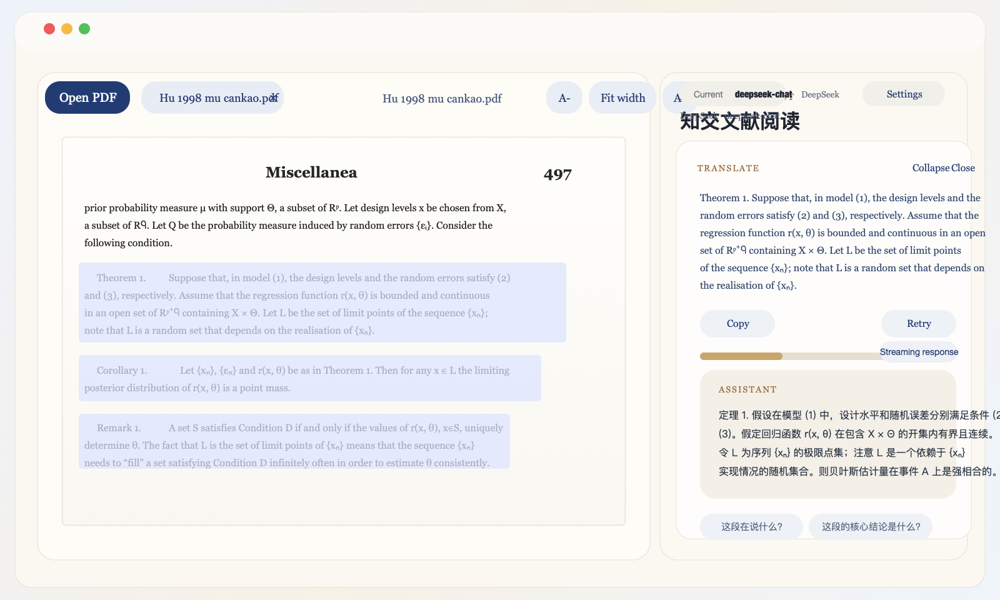

# 知交文献阅读 / ZhiJiao Reader



AI-powered paper reader for a two-pane workflow: PDF on the left; streaming translation, term explanations, and follow-up Q&A cards on the right. Highlight and annotate the original text — annotations are written back into the PDF file itself.

> **v1.1.0 — adds ZhiJiao Cloud.** Paste an activation code and read: the model and quota come from the hosted gateway, no API signup needed. Bring-your-own-key stays free and fully featured. (v1.0.0 was the stable baseline: the core loop — *select → understand in seconds → keep reading* — complete and proven by daily use.)

## Highlights

- **Math that survives real papers** — full `react-markdown` + `remark-math` + KaTeX pipeline with multiple fallbacks for imperfect model output (single-line `$$` blocks, bare LaTeX paragraphs, orphaned `\tag{}` numbers).
- **Designed for long reading sessions** — warm paper-tone theme, serif body text, adjustable font size and line height (persisted), collapsible cards, copy/retry actions.
- **Annotations live in your PDF, not in our app** — five highlight colors plus draggable comment cards, written into the file as standard PDF annotations. Interoperable with WPS, Adobe, and macOS Preview in both directions. Explicit save (`Cmd/Ctrl+S`) with undo/redo, atomic writes.
- **Excerpt into your notes** — right-click a selection to append the original text (optionally with its translation) to a local markdown folder, fully Obsidian-vault compatible.
- **Local-first, provider-agnostic** — everything runs on your machine; API keys never leave it. Switch between DeepSeek, SJTU API, OpenAI, local Codex CLI, or any OpenAI-compatible endpoint, with a built-in connection test. The backend stops consuming the model stream the moment the client disconnects.

## What It Is

- Frontend: React + Vite
- Backend: Express + Node.js
- Desktop shell: Electron
- PDF viewer: `@react-pdf-viewer/core`
- Math rendering: `react-markdown` + `remark-math` + `rehype-katex`
- AI backends: DeepSeek API, SJTU API, OpenAI API, local Codex CLI, custom OpenAI-compatible endpoints

Runs as a local web app in your browser, or as a packaged desktop build (macOS DMG / Windows installer / Linux AppImage) — see [GitHub Releases](https://github.com/Yang-wentao/zhijiao-reader/releases).

## Prerequisites

- Node.js 20+
- npm 10+
- Optional: local `codex` CLI if you want to use `Local Codex`

## Setup & Run

```bash
git clone https://github.com/Yang-wentao/zhijiao-reader.git
cd zhijiao-reader
npm install
npm run launch
```

`npm run launch` will create `.env` from `.env.example` if needed, install dependencies when missing, start both dev servers, and open the browser. Complete provider setup inside the app via the `Settings` button (the dialog opens automatically when setup is incomplete). To use markdown notes, set the notes folder path and excerpt subdirectory in `Settings`.

One-command install:

```bash
# macOS / Linux
curl -fsSL https://raw.githubusercontent.com/Yang-wentao/zhijiao-reader/main/install.sh | bash
```

```powershell
# Windows PowerShell
irm https://raw.githubusercontent.com/Yang-wentao/zhijiao-reader/main/install.ps1 | iex
```

The real `.env` file stays local and is ignored by git; runtime connection settings live in `config/providers.local.json`, also ignored by git.

Other commands:

```bash
npm run dev           # dev servers (frontend 5173 / backend 8787)
npm test              # Vitest suite
npm run electron:dev  # Electron dev mode
npm run electron:pack # build desktop packages
```

Docs: [AGENTS.md](AGENTS.md) (engineering handbook, Chinese) · [GitHub Distribution](docs/github-distribution.md) · [Electron Packaging](docs/electron-packaging.md)

## Version History

| Version | Summary |
|---|---|
| v0.1.0 | First usable build: two-pane reader + select-to-translate + streaming cards |
| v0.2.0 | First packaged macOS release (arm64/x64 DMG); full Chinese localization; Obsidian notes (community PR #1) |
| v0.2.1 | Notes off by default; select-to-translate restored |
| v0.3.0 | DeepSeek v4 models; configurable translation trigger; Windows installer polish |
| v0.3.2 | Drag-and-drop PDFs; typography controls; `\tag{}` render fixes |
| v0.3.4 | Instant tab switching; OpenAI model picker + reasoning effort |
| v0.3.5 | PDF highlights + comments written into the file (WPS/Adobe interop); explicit save, undo/redo |
| v0.3.6 | Fully localized errors; stream stops on client disconnect; model dropdown fixes |
| v1.0.0 | Stable release — no new features; 1.0 means "finished" |
| **v1.1.0** | **ZhiJiao Cloud subscription: activation-code sign-in, quota chip in the header, provider list grouped by subscription / BYOK / advanced** |

## Known Limits

- Scanned/image-only PDFs are not supported (text must be selectable)
- Translation cards do not persist across reloads (highlights/comments live in the PDF file and are unaffected)
- Writing annotations back to the file requires the desktop build (browsers cannot expose real file paths)
- Local Codex is not token-level streaming; the app simulates a readable progressive reveal client-side
- Packages are unsigned (no notarization / code signing yet) — see the Chinese README for first-launch bypass steps

The Chinese [README.md](README.md) is the primary document; this file is a condensed English companion.
